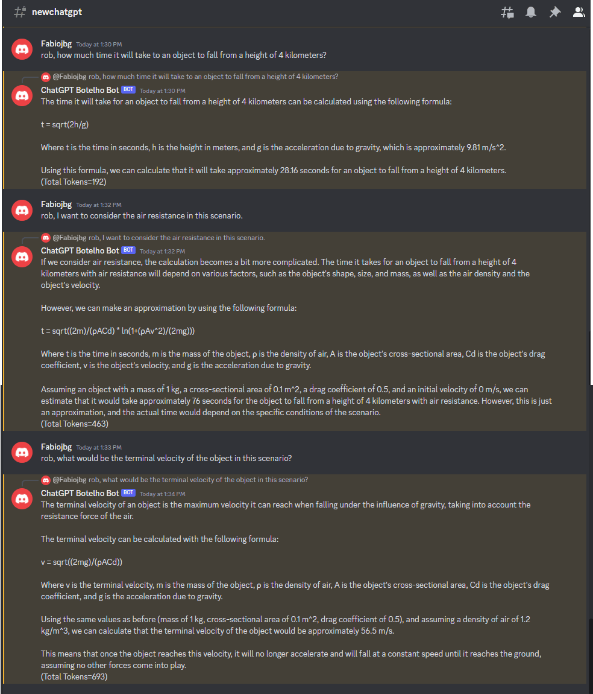

# chatGPTDiscordBot
This is a very complete chatGPT bot for Discord capable of keeping the conversation history. In fact, the bot keeps the most conversation history supported for the model. For example: if the 'gpt-3.5-turbo' model is being used, the bot will keep the most conversation history that consumes up to the 4096 tokens supported by the model. In fact, the bot saves some tokens for the bot responses, this can be set in the parameter TOKENS_TO_RESERVE_FOR_COMPLETION in the .env file.

By default, this Bot uses the 'gpt-3.5-turbo' openAI model.

To direct you messages to the bot, you must start your messages with "rob, ". 

Below there is a chat example.

To run this Bot, follow these steps:

1) Clone the repository and open it in Visual Studio Code.

2) Copy the .env_sample file and rename it to .env.

3) Create a bot in Discord and obtain its access token. Paste this token in the DISCORD_TOKEN key in the .env file.

4) Create an OpenAI account and generate an API key. Copy the OpenAI API key and OpenAI  Organization keys to the OPENAI_KEY and OPENAI_ORGANIZATION keys in the .env file.

5) Open a terminal in VS Code and run npm install.

6) Run npm start dev to start the application.

Observations:

If you wish to clear all conversation history to start a new topic, all you have to do is say: "Rob, Hi"
The conversations are stored in memory and it will be lost if the service is rebooted.

