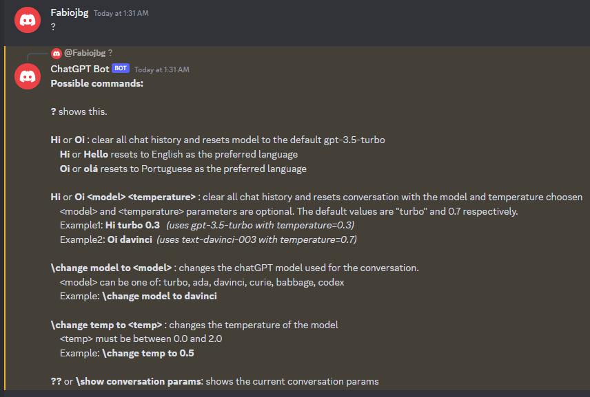

# ChatGPT Discord Bot
This is a very complete ChatGPT Bot for Discord capable of keeping the conversation history and change models and its parameters. 

Below there is a chat example.

## To run this Bot:

1) Clone the repository and open it in Visual Studio Code.

2) Copy the .env_sample file and rename it to .env.

3) Create a bot in Discord and obtain its access token. This video from Adrian Twarog can help you on this: https://www.youtube.com/watch?v=roMykVsig-A&t=83s

4) Paste the bot token generated in the previous step in the DISCORD_TOKEN key in the .env file.

5) Create an OpenAI account and generate an API key. Copy the OpenAI API key and OpenAI Organization keys to the OPENAI_KEY and OPENAI_ORGANIZATION keys in the .env file. You may need to buy some credits to use the ChatGPT api.

6) Open a terminal in VS Code and run npm install.

7) Run npm start dev to start the bot.

The **Bot** keeps the most possible conversation history supported for the model. For example: if the 'gpt-3.5-turbo' model is being used, the bot will keep the most conversation history that consumes up to the 4096 tokens supported by the model. In fact, the bot saves some tokens for the bot responses, this can be set in the parameter TOKENS_TO_RESERVE_FOR_COMPLETION in the .env file.

By default, this Bot uses the **'gpt-3.5-turbo'** openAI model. 

## How to chat with the Bot

The Bot name is Rob. If your in a channel with a lot of people, you must start your messages with "**Rob,**" to let the Bot know your directing your message to it. <u>You don't need to to this if your in a private chat with the Bot or there is only you and the Bot in the channel.</u>

## How to get help from the Bot

**Type '?'** and the Bot will list all the supported commands for you.

## Chatting with a specific model and temperature

To start a clean conversation with a specific model and temperature use the "Hi" prompt as follows:

The model and temperature parameters are <u>optional</u>. If not provided, the default values are "*turbo*" for the model and *0.7* for the temperature.

The supported models are:
 - turbo (for "gpt-3.5-turbo")
 - davinci (for "text-davinci-003")
 - ada (for "text-ada-001")
 - curie (for "text-curie-001")
 - babbage (for "text-babbage-001")
 - codex (for "code-davinci-002")

## How to change Bot behavior during conversation

You can change some of the Bot parameters while chatting with the Bot with **backlash ('\\') commands** supported by the Bot. *Keep in mind that the conversation history will not be erased and the results may be odd.*

### Changing conversation model 

You can change the model used in your conversation with this command:

The supported models are:
 - turbo (for "gpt-3.5-turbo")
 - davinci (for "text-davinci-003")
 - ada (for "text-ada-001")
 - curie (for "text-curie-001")
 - babbage (for "text-babbage-001")
 - codex (for "code-davinci-002")

### Changing conversation temperature
You can change the model temperature with this command:

Values must be beetween 0.0 and 2.0

### Showing current conversation parameters
You can view the conversation parameters any time with the ?? or the <i>\\show conversation params</i> command:

#### Warnings about this version: 
- The conversations are separated for each user and are stored only in memory in this version. All conversations will be lost if the service is rebooted. 

